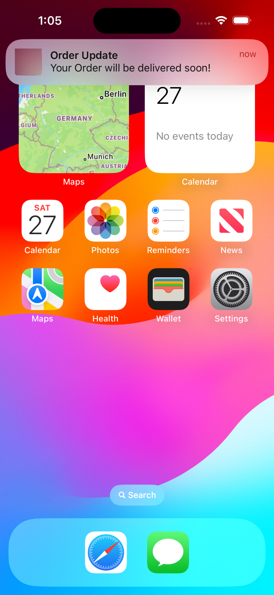

# FCM Push Notifications Test Script

## Prerequisits

You need a service-account-file.json file which includes sensitive google acc credential information to retrieve an OAuth2 AccessToken and a Firebase Project-ID. You may read this [Firebase Docs SDK Account Setup](https://firebase.google.com/docs/admin/setup#initialize_the_sdk_in_non-google_environments) for further information about how to get that json!

**Important:** Extremely high security awareness is required when working with service account keys, as they are vulnerable to certain types of threats. See [Best practices for managing service account keys](https://cloud.google.com/iam/docs/best-practices-for-managing-service-account-keys).

1. NodeJS >= v21 (stable native nodejs env file parsing & fetch support)
2. `yarn install` to install all dependencies
3. copy the content of `.env.template` and create a `.env` file near the package.json
4. Add your device `FCM_TOKEN` into the `.env` file
5. Place your generated `service-account-file.json` into the `config` directory
6. Run `yarn send`, on success your device recieves a push notification sent by firebase

If you want to know what properties inside a notification payload is supported by firebase. See [Firebase FCM message reference](https://firebase.google.com/docs/reference/fcm/rest/v1/projects.messages).

## Arrival of the Example Payload

